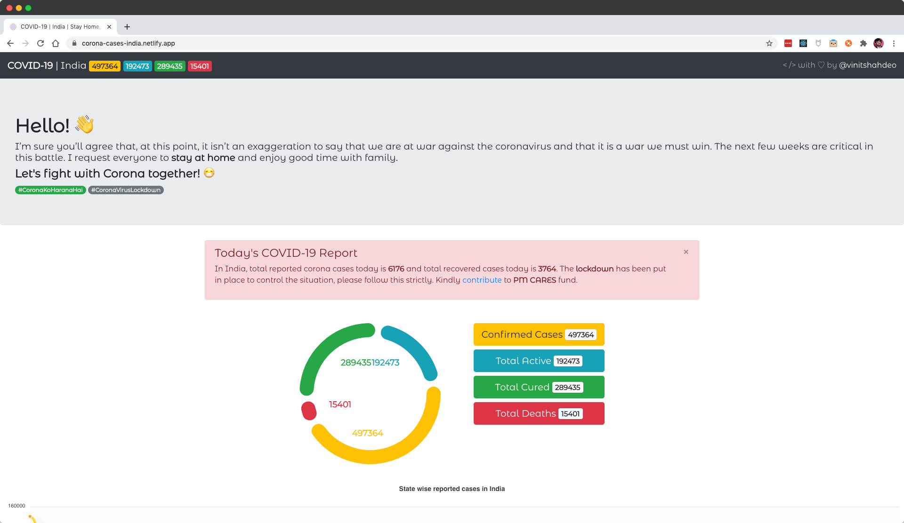
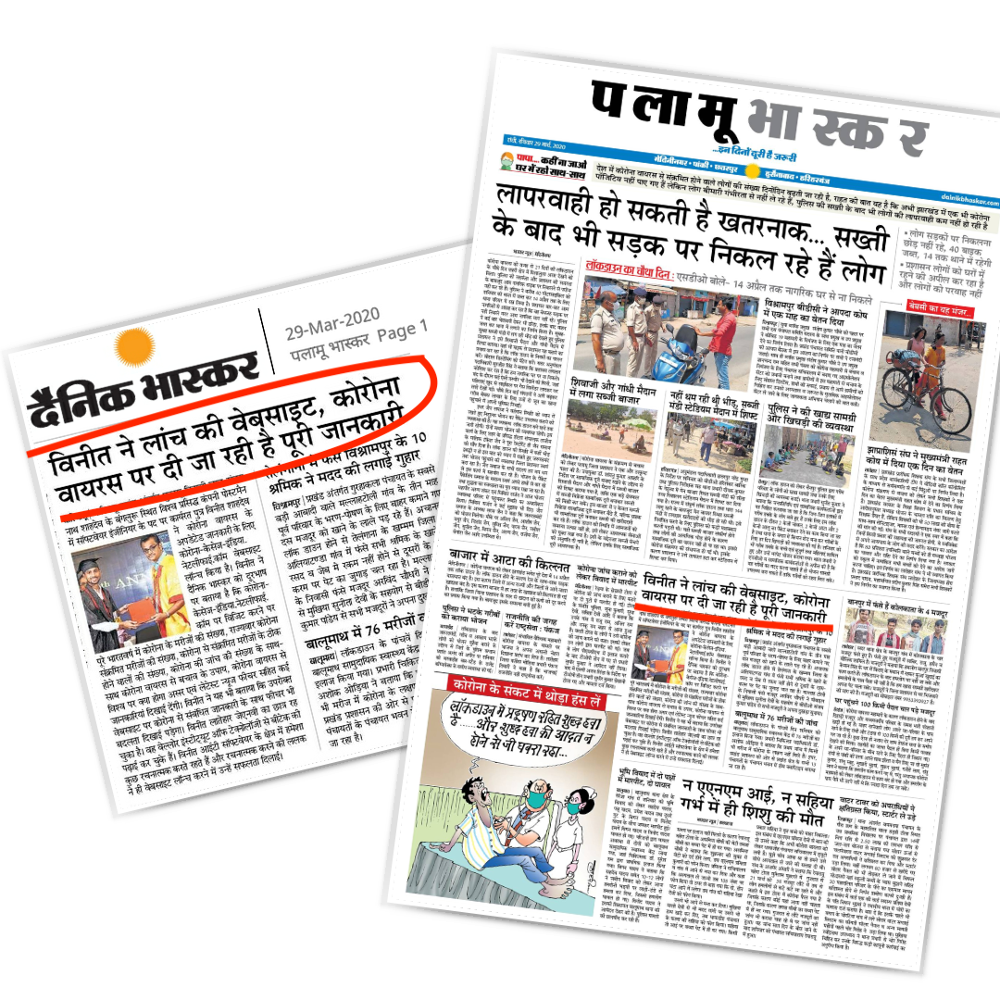

# COVID-19 🦠   
## [Let's fight together with Corona!](https://corona-cases-india.netlify.com/) :mask:
STAY HOME STAY SAFE
[](https://indiafightscorona.netlify.com/)

> ## 🚨 Check out the latest [**COVID-19 Tracker 📊 | INDIA 🇮🇳**](https://indiafightscorona.netlify.com/)

# :man: :blonde_woman: :house: :mask: :pray:


#### :mag_right: [Click here](https://corona-cases-india.netlify.com/) to visualize the state-wise :bar_chart: Corona Cases in India! Keep yourself updated with latest news related to COVID-19.

[](https://github.com/NovelCOVID/awesome-novelcovid) [](https://github.com/gayatri192005)

<a href="https://www.producthunt.com/posts/covid-19-tracker-india?utm_source=badge-featured&utm_medium=badge&utm_souce=badge-covid-19-tracker-india" target="_blank"></a>

> [This](https://corona-cases-india.netlify.com/) is a small effort from my side to keep yourself updated with number of corona cases reported in India so far. Checkout the available APIs [here](https://covid-19-apis.postman.com/). Thankful to [this](https://github.com/covid19india) organization for such a wonderful API. The Open Graph image used is taken from [here](https://dribbble.com/shots/10789714-Stay-at-home-Stay-safe).

[](https://github.com/gayatri192005/COVID19)

> #### :point_right: See [live demo](https://corona-cases-india.netlify.com/) :link: | Check [COVID-19 Tracker](https://indiafightscorona.netlify.app/) :bar_chart: | INDIA :india: | [Source Code](https://github.com/gayatri1920005/covid19api)

[](http://corona-cases-india.netlify.com/)

> ### Featured on Newspaper

[](https://github.com/vinitshahdeo/COVID19/)

<a href="https://indiafightscorona.netlify.app/"></a>

### [Stay Home, Stay Safe!](https://vinitshahdeo.github.io/COVID19/)

:wave: [DO THE FIVE](https://www.mohfw.gov.in/): Help stop coronavirus

1. **HANDS**: Wash them often :open_hands:
2. **ELBOW**: Cough into it :sneezing_face: 
3. **FACE**: Don't touch it :boy:
4. **SPACE**: Keep safe distance :walking:
5. **HOME**: Stay if you can :house:


#### Avoid Handshakes 🤝 ❌
#### Do Namastey 🙏 ✔️

```javascript
/**
 * 
 * Let's fight for Corona together!
 */
function stayAtHome() {
  eat();
  sleep();
  code();
  repeat();
}

while(_.isAlive(new Virus('COVID-19'))) {
  // Stay home, Stay safe
  stayAtHome();
}

```

## License

[](https://app.fossa.com/projects/git%2Bgithub.com%2Fvinitshahdeo%2FCOVID19?ref=badge_large)

## < /> with ♡ by 

```javascript

if (_.isAwesome(thisRepo)) {
  thisRepo.star(); // thanks in advance :p
}
```
